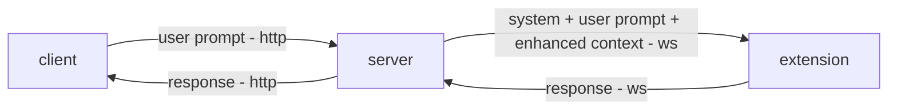

# LLM Proxy Monorepo

This project provides a system to programmatically interact with web-based LLM interfaces (like ChatGPT, Claude, and Bard) without requiring API access. It consists of three main components:

1. **Browser Extension**: Injects prompts into web LLM interfaces and captures responses
2. **Server**: Acts as a bridge between your applications and the extension
3. **Client**: Example client for interacting with the system

## Working



## Project Structure

This is a Yarn Workspace monorepo with the following packages:

```
packages/
├── server/     # Node.js server
├── extension/  # Browser extension
├── client/     # Example client application
└── shared/     # Shared utilities and types
```

## Quick Start

### Prerequisites

- Node.js v16 or higher
- Yarn v1.22 or higher
- Chrome browser

### Installation

1. Clone the repository:

   ```bash
   git clone https://github.com/yourusername/llm-proxy-monorepo.git
   cd llm-proxy-monorepo
   ```

2. Install dependencies:

   ```bash
   yarn install
   ```

3. Build the extension:

   ```bash
   yarn build:extension
   ```

4. Start the server:

   ```bash
   yarn server
   ```

5. Load the extension in Chrome:

   - Open Chrome and navigate to `chrome://extensions/`
   - Enable "Developer mode"
   - Click "Load unpacked" and select the `packages/extension/dist` directory

6. Run the client:
   ```bash
   yarn client
   ```

## Development

### Running in development mode

```bash
yarn dev
```

This will start all packages in development mode with hot reloading.

### Building for production

```bash
yarn build
```

## Documentation

Each package has its own README with detailed documentation:

- [Server Documentation](./packages/server/README.md)
- [Extension Documentation](./packages/extension/README.md)
- [Client Documentation](./packages/client/README.md)

## License

MIT
